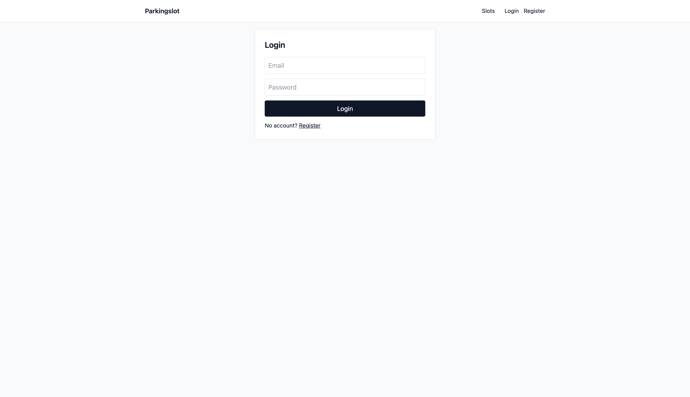
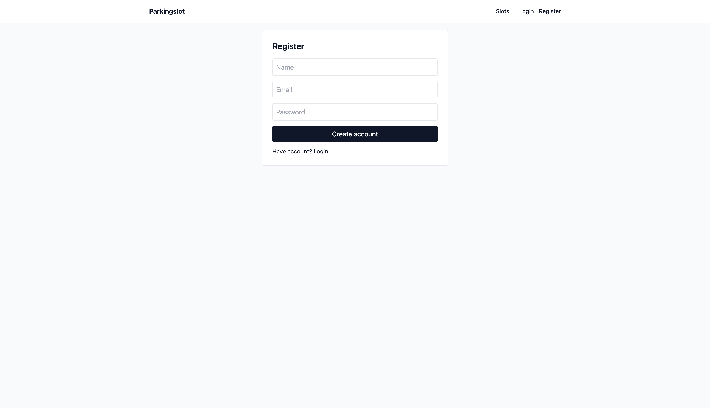
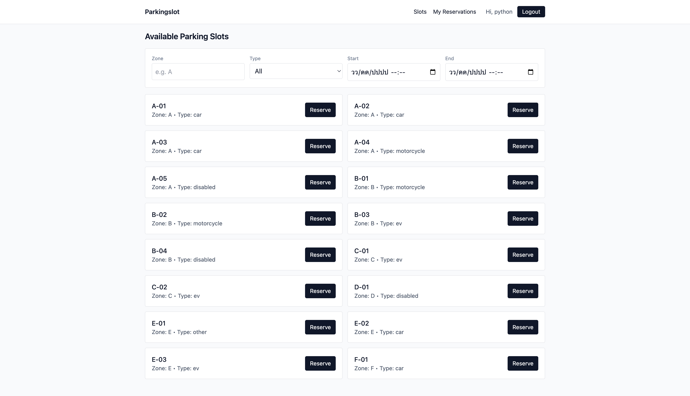
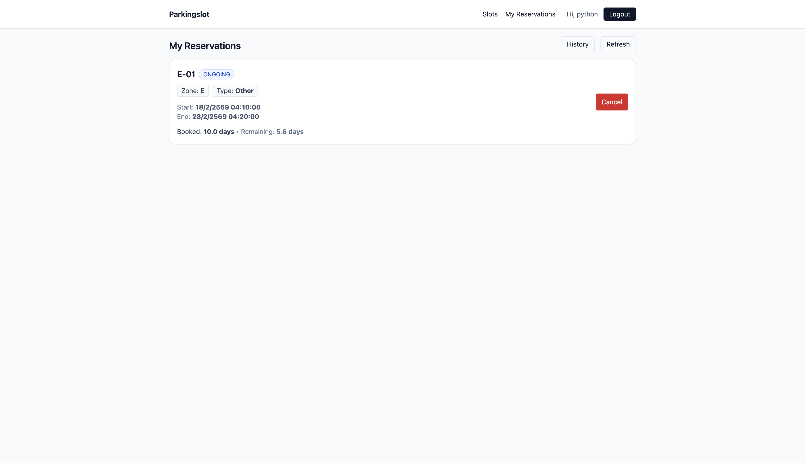
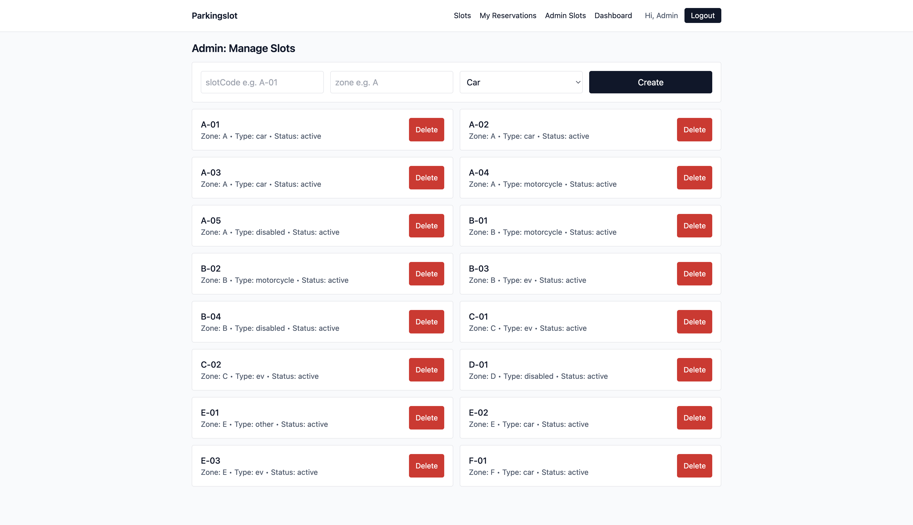

# 📦 Parking Slot Reservation System – Frontend

Frontend application for the Parking Slot Reservation System.  
Built with React (Vite) and communicates with the Next.js backend API.

---

## 🚀 Project Overview

This frontend allows users to:

- Register and Login (JWT Authentication)
- View available parking slots
- Filter by zone, type, and time range
- Reserve parking slots
- View active reservations
- View reservation history (cancelled / expired)
- Access admin dashboard (admin role only)

---

## 🏗 System Architecture

React (Vite) Frontend  
↓  
REST API (Next.js Backend)  
↓  
MongoDB Database  

---

## 🛠 Tech Stack

- React (Vite)
- Tailwind CSS
- React Router
- Recharts (Admin Dashboard charts)
- JWT Authentication (stored in localStorage)
- REST API communication

---

## 📋 Requirements

- Node.js 18+
- Backend running (default: http://localhost:3000)

---

## 🔐 Environment Variables

Create a `.env` file in the project root:

VITE_API_BASE=http://localhost:3000

For VM deployment:

VITE_API_BASE=http://YOUR_VM_IP:3000

---

## 💻 Local Development Setup

### 1️⃣ Install dependencies

cd ParkingFrontend  
npm install  

### 2️⃣ Start development server

npm run dev  

Frontend runs at:

http://localhost:5173  

---

## 🔑 Authentication Flow

1. User logs in  
2. Backend returns JWT  
3. JWT stored in localStorage  
4. Protected routes require valid token  
5. Admin routes require role = admin  

---

## 📊 Admin Dashboard Features

- Active slots  
- Reserved now  
- Available now  
- Upcoming reservations  
- Expired reservations  
- Cancelled reservations  
- Bookings today  
- Peak booking hours chart  
- Most reserved zones chart  
- Bookings by day of week chart 

---

## 📸 Screenshots

### 🔐 Login Page

---

### 📝 Register Page

---

### 🅿️ Available Parking Slots

---

### 📋 My Reservations

---

### 📋 Admin Manage Slot 

---

### 📋 Admin Dashboard

---
## 👨 Team Member

- Thanakrit Kodklangdon | [github.com/u6610936](https://github.com/u6610936) |
- kitirat Pisithaporn | [github.com/u6610387](https://github.com/u6610387) |

Student Project – CSX4107  
Parking Slot Reservation System
